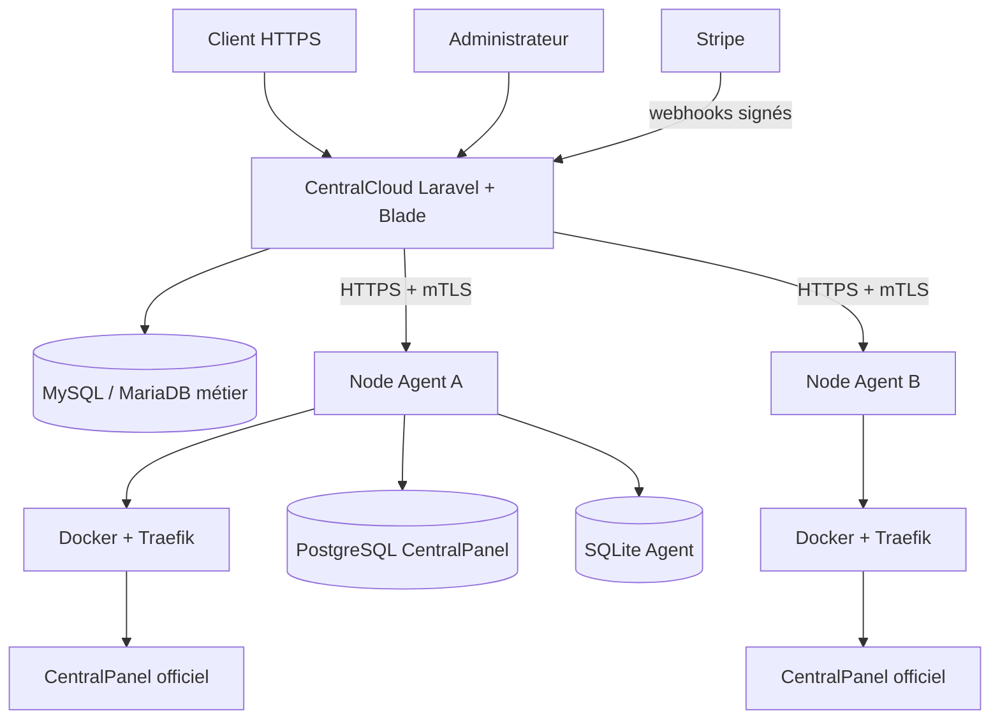

# Architecture

MySQL contient les utilisateurs, Plans, abonnements, Projects, Deployments, Nodes, opérations, événements Stripe, notifications, incidents, audits et paramètres non secrets. SQLite appartient exclusivement à chaque Agent. PostgreSQL et `/app/storage` appartiennent aux CentralPanel présents sur le Node.

`Project` est le service commercial appartenant à un `User`. `Deployment` est sa réalité technique sur un `Node`. `AgentOperation` représente une mutation asynchrone. Le statut commercial Stripe, le statut métier Project et l’état technique Agent ne sont jamais confondus.

Le navigateur n’accède jamais à un endpoint Agent. CentralCloud ne gère ni Docker, ni PostgreSQL, ni Traefik, ni les secrets locaux : il sélectionne un Node, construit une spécification autorisée et demande à l’Agent de l’exécuter.
